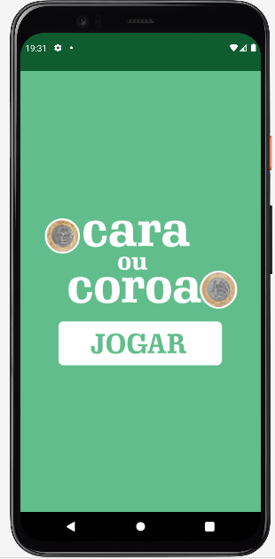

# Apresentação

Este é um aplicativo desenvolvido para jogar Cara ou Coroa.
Eu desenvolvi ele para aperfeiçoamento de conhecimento em aplicativos nativos para Android com exploração de componentes disponiveis no Android Studio.

## Recursos explorados no desenvolvimento do APP

* Navegação entre Activity.
* Passagem de parametros entre Activity.
* Troca de imagem no ImageView em tempo de execução.
* Evento click em ImageView.
* Retorno de navegação entre Activity.
* Uso de Intent.
* Recuperação de parametro recebido na Activity, por Bundle.

## Requisitos

* Gradle [https://gradle.org/](https://gradle.org/).
* Java.
* Android Studio mais recente, utilizado a versão Node ultima versão.
* Adb Devices, emulador ou aparelho fisico.